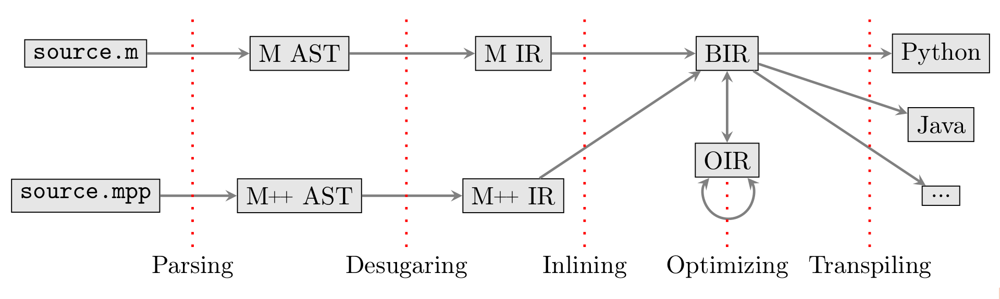

# The Mlang compiler

The M language has been invented by the French Direction Générale des Finances
Publiques, equivalent to the IRS, to transcribe the tax code into machine-readable
instructions. It is a small Domain Specific Language based on variable
declarations and arithmetic operations. This work is based on a retro-engineering
of the syntax and the semantics of M, from the [codebase](https://framagit.org/dgfip/ir-calcul)
released by the DGFiP.

## Disclaimer

There is currently no legal guarantee of any kind about the correctness of the code
produced by the Mlang compiler, or by the results produced by the interpreter of
Mlang. However, authors have been in contact with DGFiP to validate Mlang, and
the system passes all the private DGFiP tests as of Sept. 2020 for the version
of the source files responsible for computing the tax on the 2018 income.

## Installation

Mlang is implemented in OCaml. To manage dependencies,
[install opam](https://opam.ocaml.org/doc/Install.html) and switch to a version
of OCaml that is at least 4.0.9. Then, you can install Mlang's dependencies using

    make deps

Next, fetch the source code dependencies of Mlang with

    git submodule update --init --recursive

This will fetch the M source code released by the DGFiP.

You can then use `make build` to build all source files, and other dune commands.

If you want to install the `mlang` executable and the opam packages, use

    chmod +x install.h && ./install.sh

## Usage

If the `mlang` executable is install, you can consult its man page with

    mlang --help

If you invoke `make quick_test`, Make will show you the Mlang options is is 
using to run a simple test of the Mlang interpreter. 

Mlang's run are configured by a specification file (`.m_spec`), see the 
[dedicated README](specs/README.md) for more details.

For how to produce ready-to-use Python income tax computation 
source files for your application, see the 
[dedicated README](examples/python/README.md).

## Testing

Mlang is tested using the `FIP` test file format used by the DGFiP to test 
their internal tooling. The `--run_test` and `--run_all_tests` options ease 
the testing process of the interpreter (with or without optimizations) and 
report test errors in a convenient format.

Mlang backends are also tested using the same `FIP` format, see for instance 
`examples/python/backend_test`.

## Documentation

The OCaml code is self-documented using `ocamldoc` style. You can generate the HTML
documentation using

        make doc

To browse the documentation, just open the file `doc.html` with your browser. Here 
is a high-level picture describing the architecture of the compiler:

First, the code is parsed into AST (both for M and M++). Then, the AST are 
desugared into M and M++ intermediate representations. BIR stands for Backend 
IR, and collects the result of inlining the M code inside M++. OIR is the 
Optimization IR, which is a CFG-form of BIR.

## Known Limitations

The code released by the DGFiP is not complete as of September 2020. Indeed,
in order to correctly compute the amount of taxes for a fiscal household, the DGFiP
executes the M program several times, each time changing the values of some variables
to enable or disable parts of the computation.

The DGFiP has not published the source code of this iterative computation. However,
the authors of Mlang have come up with a new DSL called M++, used for describing 
the logic of this iterative computation. Currently, the authors have transcribed 
the unpublished source code into the `2018.mpp` file, which has been tested only 
for the computation of taxes for the 2018 income.

## Contributions

The project accepts pull requests. There is currently no formalized contribution
guide or centralized discussion place about the project. Please email the authors
if you are interested.

Please note that the copyright of this code is owned by Inria; by contributing,
you disclaim all copyright interests in favor of Inria.

Don't format to use `make format` before you commit to ensure a uniform style.

## Formal semantics

The `formal_semantics` folder contains two separate formalizations for the core of the
M language, that roughly corresponds to the `Mir` internal representation in Mlang.
The reference formalization is the Coq one, in file `semantique.v`. The F* formalization
is a proof of concept.

## License

The compiler is released under the GPL license (version 3).
